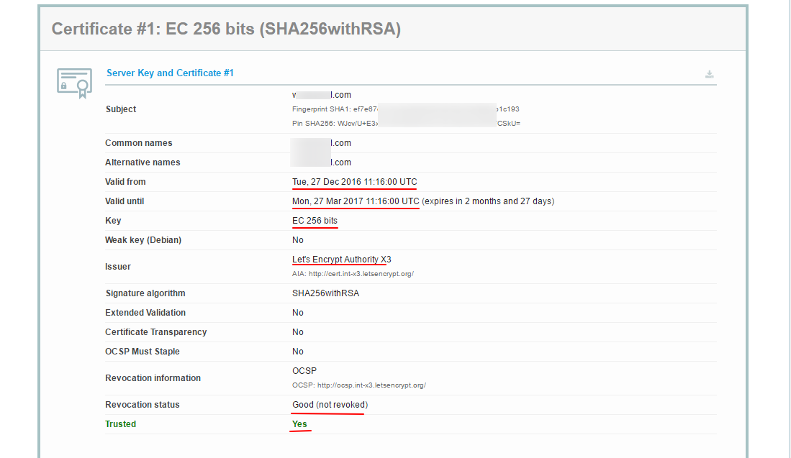

# TLS
从 v1.19 起引入了 TLS，TLS 中文译名是传输层安全，如果你没听说过，请 Google 了解一下。以下给出些我认为介绍较好的文章链接：

 [阮一峰的网络日志：SSL/TLS协议运行机制的概述](http://www.ruanyifeng.com/blog/2014/02/ssl_tls.html)

 [维基百科：传输层安全协议](https://zh.wikipedia.org/wiki/%E5%82%B3%E8%BC%B8%E5%B1%A4%E5%AE%89%E5%85%A8%E5%8D%94%E8%AD%B0)

 [编程随想的博客：扫盲 HTTPS 和 SSL/TLS 协议[1]：背景知识、协议的需求、设计的难点](https://program-think.blogspot.com/2014/11/https-ssl-tls-1.html)

 [编程随想的博客：扫盲 HTTPS 和 SSL/TLS 协议[2]：可靠密钥交换的难点，以及身份认证的必要性](https://program-think.blogspot.com/2014/11/https-ssl-tls-2.html)

 但是，Shadowsocks 的作者 clowwindy 却认为[翻墙不该用 SSL](https://gist.github.com/clowwindy/5947691)。那么到底该不该用？对此我不作评论，各位自行思考。这里我只教大家如何开启 TLS。

 ## 注册一个域名

如果已经注册有域名了可以跳过。
域名有免费的有付费的，总体来说付费的会优于免费的，具体差别请 Google。如果你不舍得为一个域名每年花点钱，用个免费域名也可以。为了方便，这里我将以免费域名为例。

关于如何注册一个免费域名，我发现有个家伙写得很详细，就不多说了。请参考：

[教你申请.tk/.ml/.cf/.gq/.ga等免费域名](https://www.dou-bi.co/dbwz-3/)

至于注册其它付费的域名请 Google 吧，差不多都是大同小异的。

**注册好域名之后务必记得设置 DNS 解析到你的 VPS !**

**据了解，在 freenom 注册的域名在对应的 IP 上要有一个网站，否则注册之后域名会被回收。如果您只是想用免费域名在 V2Ray 用一下 TLS，又不愿意（懒得、不会）建站，建议您看看您的亲朋好友谁有手上有域名的，向他们要一个二级域名就行了**

以下假设注册的域名为 mydomain.me，请将之替换成自己的域名。


## 证书生成
使用 TLS 需要证书，证书也有免费付费的，同样的这里使用免费证书，证书认证机构为 [Let's Encrypt](https://letsencrypt.org/)。
证书的生成有许多方法，这里使用的是比较简单的方法：使用 [acme.sh](https://github.com/Neilpang/acme.sh) 脚本生成，本部分说明部分内容参考于[acme.sh README](https://github.com/Neilpang/acme.sh/blob/master/README.md)。

证书有两种，一种是 ECC 证书（内置公钥是 ECDSA 公钥），一种是 RSA 证书（内置 RSA 公钥）。简单来说，同等长度 ECC 比 RSA 更安全,也就是说在具有同样安全性的情况下，ECC 的密钥长度比 RSA 短得多（加密解密会更快）。但问题是 ECC 的兼容性会差一些，Android 4.x 以下和 Windows XP 不支持。只要您的设备不是非常老的老古董，强烈建议使用 ECC 证书。

以下将给出两种证书的生成方法。

证书生成只需在服务器上操作。

### 安装 acme.sh
执行以下命令，acme.sh 会安装到 ~/.acme.sh 目录下：
```
$ curl  https://get.acme.sh | sh
% Total    % Received % Xferd  Average Speed   Time    Time     Time  Current
                               Dload  Upload   Total   Spent    Left  Speed
100   671  100   671    0     0    680      0 --:--:-- --:--:-- --:--:--   679
% Total    % Received % Xferd  Average Speed   Time    Time     Time  Current
                               Dload  Upload   Total   Spent    Left  Speed
100  112k  100  112k    0     0   690k      0 --:--:-- --:--:-- --:--:--  693k
[Fri 30 Dec 01:03:32 GMT 2016] Installing from online archive.
[Fri 30 Dec 01:03:32 GMT 2016] Downloading https://github.com/Neilpang/acme.sh/archive/master.tar.gz
[Fri 30 Dec 01:03:33 GMT 2016] Extracting master.tar.gz
[Fri 30 Dec 01:03:33 GMT 2016] Installing to /home/user/.acme.sh
[Fri 30 Dec 01:03:33 GMT 2016] Installed to /home/user/.acme.sh/acme.sh
[Fri 30 Dec 01:03:33 GMT 2016] Installing alias to '/home/user/.profile'
[Fri 30 Dec 01:03:33 GMT 2016] OK, Close and reopen your terminal to start using acme.sh
[Fri 30 Dec 01:03:33 GMT 2016] Installing cron job
no crontab for user
no crontab for user
[Fri 30 Dec 01:03:33 GMT 2016] Good, bash is found, so change the shebang to use bash as preferred.
[Fri 30 Dec 01:03:33 GMT 2016] OK
[Fri 30 Dec 01:03:33 GMT 2016] Install success!

```
### 使用 acme.sh 生成证书
#### 证书生成
执行以下命令生成证书：
```
$ sudo  acme.sh  --issue -d mydomain.me --standalone -k ec-256
[Fri Dec 30 08:59:12 HKT 2016] Standalone mode.
[Fri Dec 30 08:59:12 HKT 2016] Single domain='mydomain.me'
[Fri Dec 30 08:59:12 HKT 2016] Getting domain auth token for each domain
[Fri Dec 30 08:59:12 HKT 2016] Getting webroot for domain='mydomain.me'
[Fri Dec 30 08:59:12 HKT 2016] _w='no'
[Fri Dec 30 08:59:12 HKT 2016] Getting new-authz for domain='mydomain.me'
[Fri Dec 30 08:59:14 HKT 2016] The new-authz request is ok.
[Fri Dec 30 08:59:14 HKT 2016] mydomain.me is already verified, skip.
[Fri Dec 30 08:59:14 HKT 2016] mydomain.me is already verified, skip http-01.
[Fri Dec 30 08:59:14 HKT 2016] mydomain.me is already verified, skip http-01.
[Fri Dec 30 08:59:14 HKT 2016] Verify finished, start to sign.
[Fri Dec 30 08:59:16 HKT 2016] Cert success.
-----BEGIN CERTIFICATE-----
MIIEMTCCAxmgAwIBAgISA1+gJF5zwUDjNX/6Xzz5fo3lMA0GCSqGSIb3DQEBCwUA
MEoxCzAJBgNVBAYTAlVTMRYwFAYDVQQKEw1MZXQncyBFbmNyeXB0MSMwIQYDVQQD
ExpMZXQncyBFbmNyeXB0IEF1dGhvcml0eSBYMzAeFw0xNjEyMjkyMzU5MDBaFw0x
NzAzMjkyMzU5MDBaMBcxFTATBgNVBAMTDHdlYWtzYW5kLmNvbTBZMBMGByqGSM49
****************************************************************
4p40tm0aMB837XQ9jeAXvXulhVH/7/wWZ8/vkUUvuHSCYHagENiq/3DYj4a85Iw9
+6u1r7atYHJ2VwqSamiyTGDQuhc5wdXIQxY/YQQqkAmn5tLsTZnnOavc4plANT40
zweiG8vcIvMVnnkM0TSz8G1yzv1nOkruN3ozQkLMu6YS7lk/ENBN7DBtYVSmJeU2
VAXE+zgRaP7JFOqK6DrOwhyE2LSgae83Wq/XgXxjfIo1Zmn2UmlE0sbdNKBasnf9
gPUI45eltrjcv8FCSTOUcT7PWCa3
-----END CERTIFICATE-----
[Fri Dec 30 08:59:16 HKT 2016] Your cert is in  /root/.acme.sh/mydomain.me_ecc/mydomain.me.cer
[Fri Dec 30 08:59:16 HKT 2016] Your cert key is in  /root/.acme.sh/mydomain.me_ecc/mydomain.me.key
[Fri Dec 30 08:59:16 HKT 2016] The intermediate CA cert is in  /root/.acme.sh/mydomain.me_ecc/ca.cer
[Fri Dec 30 08:59:16 HKT 2016] And the full chain certs is there:  /root/.acme.sh/mydomain.me_ecc/fullchain.cer
```
`-k` 表示密钥长度，后面的值可以是 `ec-256` 、`ec-284`、`2048`、`3072`、`4096`、`8192`，带有 `ec` 表示生成的是 ECC 证书，没有则是 RSA 证书。在安全性上 256 位的 ECC 证书等同于 3072 位的 RSA 证书。

上面的命令会临时监听 80 端口，请确保执行该命令前 80 端口没有使用。
#### 证书更新
由于 Let's Encrypt 的证书有效期只有 3 个月，因此需要 90 天至少要更新一次证书，acme.sh 脚本会每 60 天自动更新证书。也可以手动更新。

手动更新 ECC 证书，执行：
```
$ sudo acme.sh --renew -d mydomain.com --force --ecc
```

如果是 RSA 证书则执行：
```
$ sudo acme.sh --renew -d mydomain.com --force
```
### 安装证书和密钥

#### ECC 证书
将证书和密钥安装到 /etc/v2ray 中：
```
$ sudo acme.sh --installcert -d mydomain.me --fullchainpath /etc/v2ray/v2ray.crt --keypath /etc/v2ray/v2ray.key --ecc
```
#### RSA 证书
```
$ sudo acme.sh --installcert -d mydomain.me --fullchainpath /etc/v2ray/v2ray.crt --keypath /etc/v2ray/v2ray.key
```

**注意：无论什么情况，密钥(即上面的v2ray.key)都不能泄漏**

## 配置 V2Ray

服务器配置：
```javascript
{
  "inbound": {
    "port": 443, // 建议使用 443 端口
    "protocol": "vmess",    
    "settings": {
      "clients": [
        {
          "id": "23ad6b10-8d1a-40f7-8ad0-e3e35cd38297",  
          "alterId": 64
        }
      ]
    },
    "streamSettings": {
      "network": "tcp",
      "security": "tls", // security 要设置为 tls 才会启用 TLS
      "tlsSettings": {
        "certificates": [
          {
            "certificateFile": "/etc/v2ray/v2ray.crt", //证书文件
            "keyFile": "/etc/v2ray/v2ray.key" //密钥文件
          }
        ]
      }
    }
  },
  "outbound": {
    "protocol": "freedom",
    "settings": {}
  }
}
```

客户端配置：

```javascript
{
  "inbound": {
    "port": 1080,
    "protocol": "socks",
    "settings": {
      "auth": "noauth"
    }
  },
  "outbound": {
    "protocol": "vmess",
    "settings": {
      "vnext": [
        {
          "address": "mydomain.me",
          "port": 443,
          "users": [
            {
              "id": "23ad6b10-8d1a-40f7-8ad0-e3e35cd38297",
              "alterId": 64
            }
          ]
        }
      ]
    },
    "streamSettings": {
      "network": "tcp",
      "security": "tls" // 客户端的 security 也要设置为 tls
    }
  }
}
```

## 验证
一般来说，按照以上步骤操作完成，V2Ray 客户端能够正常联网说明 TLS 已经成功启用。但是有个工具进行验证无疑更令人放心。
验证的方法有很多，我仅介绍一种小白化一点的，便是 [Qualys SSL Labs's SSL Server Test](https://www.ssllabs.com/ssltest/index.html)。

**注意：使用 Qualys SSL Labs's SSL Server Test 要求使用 443 端口，意味着你服务器配置的 inbound.port 应当是 443**

打开 [Qualys SSL Labs's SSL Server Test](https://www.ssllabs.com/ssltest/index.html)，在
Hostname 中输入你的域名，点提交，过一会结果就出来了。


这是对于你的 TLS/SSL 的一个总体评分，我这里评分为 A，看来还不错。有这样的界面算是成功了。


这是关于证书的信息。从图中可以看出，我的这个证书有效期是从 2016 年 12 月 27 号到 2017 年的 3 月 27 号，密钥是 256 位的 ECC，证书签发机构是 Let's Encrypt，重要的是最后一行，`Trusted` 为 `Yes`,表明我这个证书可信。
